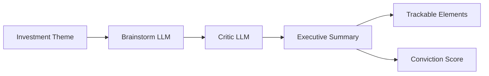
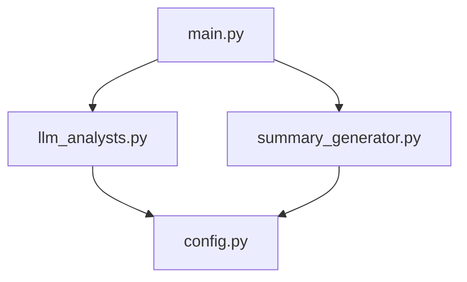

# Investment Idea Generation Backend

> Generate and critique actionable investment ideas using dual LLM analysts (Grok API).


A modular Python backend that uses the Grok API (OpenAI-compatible) to generate and critique investment ideas. Two analyst LLMs work in sequence: a brainstormer produces 3-5 actionable ideas with catalysts and supporting arguments, and a critic provides counterarguments and constructive suggestions.

## How It Works



- **Brainstorm LLM** - Generates 3-5 ideas with catalysts, actionable opportunities, and supporting arguments
- **Critic LLM** - Reviews each idea with counterarguments and constructive suggestions
- **Executive Summary** - Aligns pro/con views by idea
- **Trackable Elements** - Extracts catalyst, timeline, metric, and ticker for each idea
- **Conviction Score** - Weighted score (1-10) based on your confidence in each idea

## Architecture



## Setup

1. Copy the environment template and add your xAI API key:

   ```bash
   cp .env.example .env
   ```

   Edit `.env` and set `GROK_API_KEY` to your xAI API key from [xAI Console](https://console.x.ai/).

2. Create a virtual environment and install dependencies:

   ```bash
   python3 -m venv .venv
   source .venv/bin/activate   # On Windows: .venv\Scripts\activate
   pip install -r requirements.txt
   ```

## Usage

Activate the virtual environment (if not already active), then run:

```bash
source .venv/bin/activate
python main.py
```

- Enter an investment theme (or press Enter for the default: "AI in healthcare").
- The app will generate ideas, run the critic, and print the executive summary and trackable elements.
- Enter weights (1-10) for each idea, comma-separated, to compute a conviction score.

## Project Structure

```
project_jam/
├── src/
│   ├── config.py           # API key, prompts, Grok settings
│   ├── llm_analysts.py     # brainstorm_ideas, critique_ideas
│   └── summary_generator.py # format_exec_summary, parse_trackable_elements, calculate_conviction
├── main.py                 # Console entry point
├── requirements.txt
├── .env.example
└── README.md
```

## Test Theme

Example: `AI in healthcare` - generates ideas across sectors with measurable catalysts and actionable opportunities.
