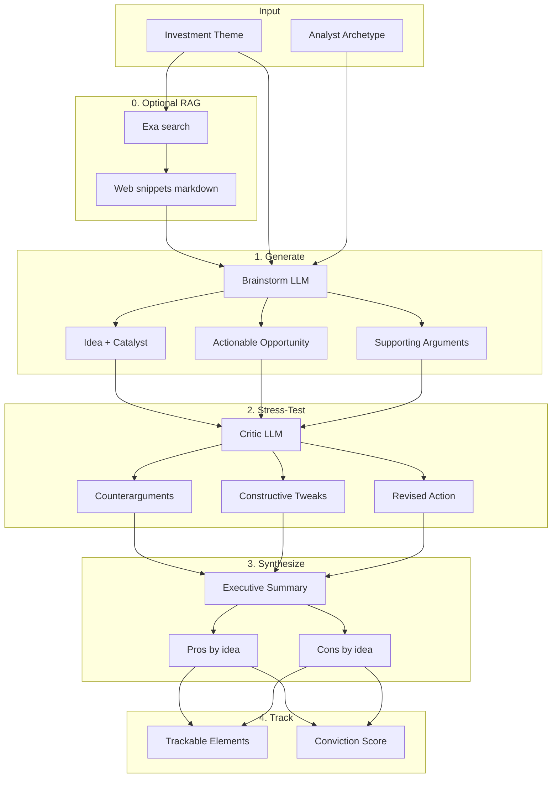
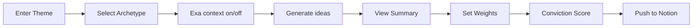
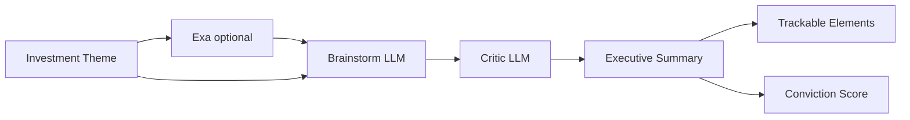
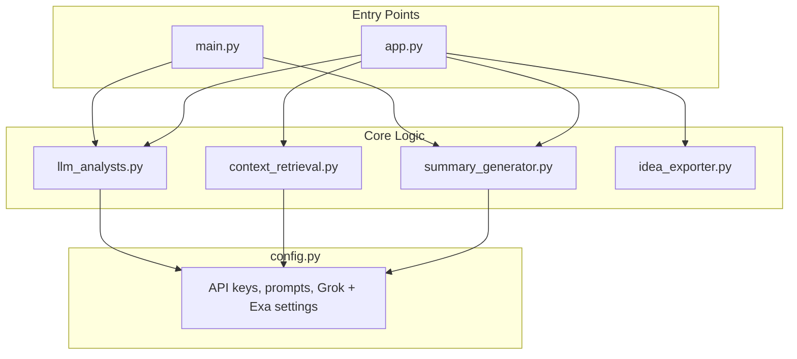

# Investment Ideas Generation Backend

A personal side project exploring dual-LLM agents (with the Grok API).

I built a modular Python backend and a Streamlit UI (Matrix-style terminal) where two LLM "analysts" work together: one generates ideas, the other critiques them. **Optional RAG**: before brainstorming, the app can pull recent web snippets via **[Exa](https://exa.ai)** and pass them into the combined Grok prompt so ideas are grounded in fresher context. The goal was to experiment with structured prompting, retrieval, agent workflows, and turning outputs into something usable (executive summary + trackable elements + Notion export).


**Status**: Working MVP — actively tinkering and adding features (March 2026).

[](https://www.python.org) 
[](https://x.ai)
[](https://streamlit.io)
[](https://developers.notion.com)

## What it does
- Enter a theme + choose an analyst archetype (logical, visionary, conservative, etc. — see the app)
- **Optional RAG:** enable **Exa context** with `EXA_API_KEY` to fetch recent web snippets and inject them before the brainstorm
- Brainstormer generates 3–5 ideas with catalysts and arguments
- Critic reviews each one and suggests improvements
- Produces a clean executive summary (formatted as a terminal session log in Streamlit)
- Calculates a simple conviction score based on weights you set
- One-click export to a Notion database (optional but working)

## Thought Process

The system follows an analyst workflow: **generate → stress-test → synthesize → track**.



| Phase | What Happens |
|-------|--------------|
| **0. RAG (optional)** | If `EXA_API_KEY` is set and Exa context is on, recent web results are summarized into a markdown block prepended to the brainstorm prompt. |
| **1. Generate** | Brainstormer produces 3–5 ideas. Each idea: catalyst, actionable opportunity, supporting arguments. |
| **2. Stress-Test** | Critic reviews each idea for counterarguments, tweaks, and revised actions. |
| **3. Synthesize** | Pro/con views aligned by idea in an executive summary table. |
| **4. Track** | Extract catalyst, timeline, metric, ticker for each idea; compute conviction score. |

**Style:** Every idea is underwritten by a single, measurable catalyst. Output is concise and specific—think hedge-fund analyst memo for a PM. See [AGENTS.md](AGENTS.md) for prompt structure and tone.

### User Flow (Streamlit)



## End-to-End Pipeline



- **Exa (optional)** - Retrieves recent snippets for the theme; see `src/context_retrieval.py`
- **Brainstorm LLM** - Generates 3-5 ideas with catalysts, actionable opportunities, and supporting arguments (can include RAG context in one combined Grok call in Streamlit)
- **Critic LLM** - Reviews each idea with counterarguments and constructive suggestions
- **Executive Summary** - Aligns pro/con views by idea
- **Trackable Elements** - Extracts catalyst, timeline, metric, and ticker for each idea
- **Conviction Score** - Weighted score (1-10) based on your confidence in each idea

## Architecture



## Setup

1. Copy the environment template and add your xAI API key:

   ```bash
   cp .env.example .env
   ```

   Edit `.env` and set `GROK_API_KEY` to your xAI API key from [xAI Console](https://console.x.ai/).

   **Optional — retrieval (RAG):** set `EXA_API_KEY` from [Exa](https://exa.ai) so the Streamlit app and CLI can pull recent web snippets before brainstorming. If the key is missing, the app still runs; leave Exa context off or ignore the warning. Tune defaults in code or via env: `EXA_NUM_RESULTS`, `EXA_TEXT_MAX_CHARACTERS`, `EXA_RECENCY_DAYS` (see `src/config.py`).

2. Create a virtual environment and install dependencies:

   ```bash
   python3 -m venv .venv
   source .venv/bin/activate   # On Windows: .venv\Scripts\activate
   pip install -r requirements.txt
   ```

## Usage

Activate the virtual environment (if not already active), then run:

**Console (main.py):**
```bash
source .venv/bin/activate
python main.py
```

- Enter an investment theme (or press Enter for the default: "AI in healthcare").
- Optionally use **Exa web context** when prompted (requires `EXA_API_KEY`), or pass `--no-web-context` in non-interactive mode.
- The app will generate ideas, run the critic, and print the executive summary and trackable elements.
- Enter weights (1-10) for each idea, comma-separated, to compute a conviction score.

**Streamlit (app.py):**
```bash
streamlit run app.py
```

- Enter theme, select archetype, toggle **Exa context** if you use Exa, then **Generate investment ideas**.
- View the terminal session log (executive summary + trackables + critic), set conviction weights, and **Push session to Notion** when configured.

## Export to Notion

After generating ideas in the Streamlit app, use **Push session to Notion** to add them to your idea database.

1. Create a [Notion integration](https://www.notion.so/my-integrations) and copy the API key.
2. Create a database in Notion with these properties:

   | Property | Type | Description |
   |----------|------|-------------|
   | idea_id | rich_text | Unique identifier (UUID) |
   | Title | title | Idea one-liner |
   | Theme | rich_text | Investment theme |
   | Ticker | rich_text | Stock symbol |
   | Action | rich_text | Actionable opportunity |
   | Catalyst | rich_text | Trackable catalyst |
   | Timeline | rich_text | Time horizon |
   | Metric | rich_text | Key metric |
   | Pros | rich_text | Full pros text |
   | Cons | rich_text | Full cons text |
   | Keywords | multi_select | 2-3 broad keywords |
   | Date | date | Export timestamp |

3. Share the database with your integration (⋯ → Add connections).
4. Copy the database ID from the URL (`notion.so/...?v=xxx` → the 32-char hex before `?`).
5. Add to `.env`:
   ```
   NOTION_API_KEY=secret_xxx
   NOTION_DATABASE_ID=xxx
   ```

## Project Structure

```
project_jam/
├── src/
│   ├── config.py              # API keys, prompts, Grok + optional Exa settings
│   ├── context_retrieval.py   # fetch_web_context_markdown (Exa RAG)
│   ├── idea_exporter.py       # export_to_notion
│   ├── llm_analysts.py        # brainstorm / critic / combined Grok calls
│   └── summary_generator.py   # format_exec_summary, parse_trackable_elements, calculate_conviction
├── app.py                  # Streamlit web app
├── main.py                 # Console entry point
├── requirements.txt
├── .env.example
└── README.md
```

## Screenshots
[to add 3–4 simple screenshots here — Streamlit UI, sample output, Notion export.]

--


## Test Theme

Example: `AI in healthcare` - generates ideas across sectors with measurable catalysts and actionable opportunities.

## Future explorations (learning roadmap)
- Richer RAG (chunking, citations, domain filters)
- Persistent idea history beyond in-session query list (local JSON)
- Auto-pull price/data for conviction scoring
- PDF/Markdown export
- Scheduled runs

I’m still learning so this is my playground to practice. Feedback or suggestions always welcome!


